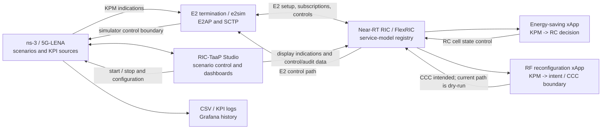

# RIC-TaaP Integration Report

> **Status:** integration overview based on the current `ns-O-RAN-flexric` documentation, modified 5G-LENA reporting implementation, and the RF xApp source. This report distinguishes documented architecture from capabilities demonstrated by the current validation runs.

## Contents

- [Executive summary](#executive-summary)
- [Scope and repository map](#scope-and-repository-map)
- [Architecture and data flow](#architecture-and-data-flow)
- [Components and interfaces](#components-and-interfaces)
- [Standards and reporting model](#standards-and-reporting-model)
- [Integrated use cases](#integrated-use-cases)
- [Build and operational workflow](#build-and-operational-workflow)
- [Validation evidence](#validation-evidence)
- [Limitations and next milestones](#limitations-and-next-milestones)
- [References](#references)

## Executive summary

RIC-TaaP (RIC Testing as a Platform) combines an ns-3-based 5G digital-twin environment, an E2 termination, FlexRIC as the near-RT RIC, xApps, and RIC-TaaP Studio. The integration is intended to make system-level O-RAN testing reproducible: simulated RAN components produce KPIs, the E2 path carries observations to the RIC, xApps make policy decisions, and control messages can return to the simulated gNB.

The platform documentation identifies support for E2AP v1.01, E2SM-KPM v3.00, E2SM-RC v1.03, and E2SM-CCC v06.00. The energy-saving flow is documented as KPM observation plus RC cell control. The RF reconfiguration design is documented as KPM observation plus CCC antenna/power control, but the current `rf_reconfiguration_xapp.c` implementation is deliberately conservative: it subscribes to KPM, emits typed antenna-state intent, defaults to `kpm-first` and dry-run, and reports that native CCC is unavailable in the current FlexRIC checkout rather than claiming live RF control.

## Scope and repository map

### Platform boundaries

| Area | Primary location | Responsibility |
|---|---|---|
| Integration documentation and scenarios | `ns-O-RAN-flexric/` | Holds the ns-3 integration, scenario configuration, documentation, and submodule pointers. |
| E2 termination | `ns-O-RAN-flexric/e2sim-kpmv3/e2sim/` | Encodes/decodes E2 messages and connects the simulator to the RIC over E2/SCTP. |
| ns-3 radio simulation | `ns-O-RAN-flexric/mmwave-LENA-oran/` | Runs mmWave/5G-LENA scenarios and exposes reporting/control hooks. |
| Near-RT RIC | `flexric/` | Provides the RIC runtime, service-model APIs, xApp build targets, subscriptions, and control-message boundary. This is a sibling checkout, not part of the top-level integration repository. |
| xApps | `flexric/examples/xApp/c/orange/` | Consumes KPM indications and performs use-case-specific decisions. |
| Studio and dashboards | `ns-O-RAN-flexric/mmwave-LENA-oran/GUI/` | Starts simulations, displays cells/UEs and KPIs, and presents use-case dashboards. |
| ASN.1 support | `asn1c/` and generated component code | Supplies protocol-model generation/build support; it is outside the application changes described here. |

The five principal integrated components named by the project README are `e2sim`, `ns3-mmWave`, `ns-O-RAN`, 5G-LENA NR, and the ns-3 Sionna RT port. They are combined rather than treated as a single monolithic application.

## Architecture and data flow

The closed loop has four logically separate stages:

1. **Observe:** ns-3/5G-LENA measures radio, protocol, energy, and E2 metrics at configured intervals.
2. **Transport:** the simulator’s ns-O-RAN integration sends E2 indications through e2sim to FlexRIC.
3. **Decide:** an xApp subscribes to a service model, evaluates reports, and selects a cell or RF action.
4. **Control and audit:** a supported control service model can carry the decision back to the simulator; logs and Studio panels expose the result. Where control is not available, the current RF xApp records intent and a diagnostic instead.

## Components and interfaces

### Simulator and E2 termination

The modified ns-3 environment contains mmWave and 5G-LENA scenarios, E2 reporting in the gNB network device, and optional file logging. `E2Periodicity` controls reporting intervals; the fork also exposes CU-UP metrics, antenna-port state, power samples, and energy information. `e2sim-kpmv3/e2sim` provides the simulator-side E2 termination and is built separately before ns-3.

### Near-RT RIC and xApps

FlexRIC runs `nearRT-RIC`, accepts E2 node registration and service-model subscriptions, and hosts xApps. The xApps in the integration are application processes, not simulator code. They use KPM for observation and use RC or CCC only at the control boundary supported by the selected FlexRIC build.

### RIC-TaaP Studio

Studio is a web interface for simulation lifecycle and observation. The README documents scenario selection, configurable run flags, live cell/UE visualization, KPI refresh, A1 policy operations, and Grafana integration. The documented endpoints are `http://127.0.0.1:8000` for Studio and `http://127.0.0.1:3000` for Grafana. First deployment can take up to five minutes.

## Standards and reporting model

| Interface / service model | Version in platform documentation | Integration role | Current evidence boundary |
|---|:---:|---|---|
| E2AP | v1.01 | E2 setup, node registration, subscriptions, and control transport | Required FlexRIC build configuration; live setup is evidenced in validation notes. |
| E2SM-KPM | v3.00 | KPI indications for xApp observation | KPM v3 indication handling and report-style subscription are implemented in the RF xApp. |
| E2SM-RC | v1.03 | Cell switch on/off control for energy saving | Energy-saving guide documents the RC control flow; use the matching FlexRIC branch/build. |
| E2SM-CCC | v06.00 | Antenna-port and transmit-power configuration | Simulator-side concepts and intended architecture are documented; native CCC encoding is unavailable in the current RF validation checkout. |

The LENA reporting reference catalogs 76 reporting parameters: 66 implementable and 10 derivable. Examples include PHY SINR/RSRP, PRB utilization, MAC scheduling, RLC/PDCP volume and delay, RRC events, E2 throughput, antenna-port state, power, energy, CSV logging, and E2 periodicity. “Implementable” means a trace/API or integration path exists; “derivable” means an aggregation or time-window calculation is still required.

Important reporting caveats are preserved rather than hidden:

- KPM UE throughput is derived from successive PDCP byte samples.
- Some E2 fields depend on the selected mapping policy and source availability.
- E2 CSV output mirrors periodic GUI/E2 metrics, while CCC power sampling is a separate 100 ms model operation.
- The reporting document describes explicit-rejection, metadata-preserving, and legacy-compatibility mapping policies; consumers should select a policy consciously because compatibility can differ from layer fidelity.

## Integrated use cases

### Energy saving: cell switch on/off

The documented scenario is `scratch/Energy_saving_with_cell_utilization_scenario.cc`; the xApp binary is `xapp_es_with_cell_util`. It subscribes to KPM per-cell PRB utilization, identifies low-utilization cells for deep sleep, and uses neighboring load to decide when a cell should return to service. The documented control path is RC v1.03, with the use case associated with O-RAN Use Case 21, sub-use case 4.21.3.1.

Studio’s Energy Saving dashboard presents UE downlink throughput, active/deep-sleep state, PRB utilization, energy consumption, and QoS impact. The terminal workflow uses three processes: `nearRT-RIC`, the ns-3 scenario, and `xapp_es_with_cell_util`. The complete procedure and branch prerequisites are in [`xapp-energy-saving.md`](xapp-energy-saving.md).

### RF channel reconfiguration

The documented scenario is `scratch/RF_Reconfiguration.cc`; the xApp binary is `rf_reconfiguration_xapp`. The intended CCC flow changes active antenna ports and transmit-power scaling in response to KPM observations. The simulator-side reference identifies `GetPortPower()`, `SetPortPower()`, `GetPortPowerScaling()`, `E2Periodicity`, 100 ms power sampling, and `nr-cu-up-cell-<id>.txt` logging as relevant implementation points.

The current RF executable has a narrower validated contract:

- It loads `RF_XAPP_POWER_THRESHOLD`, `RF_XAPP_HYSTERESIS`, `RF_XAPP_COOLDOWN_MS`, `RF_XAPP_DRY_RUN`, `RF_XAPP_NODE_INDEX`, and `RF_XAPP_TRANSPORT`.
- It discovers connected E2 nodes, locates KPM function ID `2`, discovers report styles, and subscribes to KPM v3 indications.
- It handles KPM format 1 and format 3 real-valued measurements, applies threshold/hysteresis/cooldown logic, and emits `antenna-state` intent diagnostics.
- The default transport is `kpm-first`; dry-run defaults to true. `native-ccc` reports that the current FlexRIC checkout has no CCC encoder/API, while `rc-compatibility` retains typed intent without claiming CCC fidelity.
- It removes successful KPM subscriptions and waits for clean xApp shutdown.

Thus, the RF dashboard and simulator model describe the target observation/control experience, but the current validation only claims KPM observation, decision/audit output, and dry-run behavior—not a live CCC antenna-mask or RF-state change. See [`xapp-rf-reconfiguration.md`](xapp-rf-reconfiguration.md) for the detailed guide and its validation notes.

## Build and operational workflow

### Prerequisites

The README recommends Ubuntu 22.04, at least 8 GB RAM, and 20 GB free disk space. Required packages include a C/C++ toolchain, CMake, SCTP development headers, Autotools, Bison/Flex, Boost, `g++13`, Python 3.8, and `nlohmann-json3-dev`; SQLite, Eigen3, and Docker Compose are optional or feature-dependent. On Ubuntu 24.04+, the README warns against replacing system Python and recommends a Python 3.8 virtual environment.

### Build order

1. **Prepare FlexRIC:** configure the near-RT RIC for E2AP v1 and KPM v3 (`-DE2AP_VERSION=E2AP_V1 -DKPM_VERSION=KPM_V3_00`), then build and install the service models. Use the branch/commit required by the selected xApp guide; the energy-saving and RF guides name different branch expectations.
2. **Build e2sim:** from `e2sim-kpmv3/e2sim`, run `build_e2sim.sh` with an appropriate log level. Level 2 is the documented default; level 3 adds detailed ASN.1 message output.
3. **Build ns-3:** from `mmwave-LENA-oran`, run `./ns3 configure` and `./ns3 build`.
4. **Optionally deploy Studio:** set `NS3_HOST` in `GUI/docker-compose.yml`, run `docker-compose up --build -d`, and install the Python InfluxDB client as documented.

### Run order

For either use case, the reproducible terminal pattern is:

1. Start `flexric/build/examples/ric/nearRT-RIC`.
2. Start the selected ns-3 scenario from `mmwave-LENA-oran`.
3. Start the matching xApp from `flexric/build/examples/xApp/c/orange/`.
4. Inspect terminal logs and scenario output; when Studio is deployed, connect it to FlexRIC and use the matching dashboard.

The Studio path replaces direct scenario startup with **Connect to FlexRIC**, **Show Form**, scenario selection, and **Start**. `gui_trigger.py` can push ns-3 KPIs to the database; `ns3_run.log` contains simulator runtime logs. Detailed commands remain in the [Energy Saving guide](xapp-energy-saving.md), [RF guide](xapp-rf-reconfiguration.md), and [main README](../README.md).

## Validation evidence

| Capability | Classification | Evidence or boundary |
|---|---|---|
| Service-model version declaration | Implemented/documented | README specifies E2AP v1.01, KPM v3.00, RC v1.03, and CCC v06.00. |
| ns-3 reporting and logging hooks | Implemented | LENA reference maps concrete files, classes, traces, E2 periodicity, and CSV output. |
| KPM v3 report-style discovery/subscription | Implemented and observed | RF xApp code discovers KPM styles, subscribes, consumes formats 1/3, and tears down subscriptions. |
| E2 registration and KPM indications | Validated for the RF smoke test | The RF guide records one registered E2 node, E42 setup, both KPM report styles, indications, an antenna-state intent, and clean deletion of both subscriptions. |
| Energy-saving RC closed loop | Documented use-case path | The guide identifies KPM PRB observation and RC cell control; reproduce with the matching FlexRIC branch and simulator scenario. |
| RF threshold/hysteresis/cooldown decision | Implemented | Runtime configuration and intent emission are in `rf_reconfiguration_xapp.c`. |
| RF CCC antenna-mask application | Dry-run / blocked in current checkout | The validation used dry-run; no CCC antenna-mask application or RF-state change is claimed. |
| Native CCC transport in current FlexRIC checkout | Blocked | The xApp emits `native-ccc-unavailable` because no CCC encoder/API is available. |
| RC compatibility transport for RF intent | Diagnostic only | The xApp explicitly says typed intent is retained without CCC fidelity; this is not equivalent to CCC control. |
| GUI lifecycle and dashboards | Implemented/documented | README and use-case guides document scenario control, KPI views, and dashboard panels; GUI deployment is environment-dependent. |

The validation boundary is intentional: a successful KPM observation run proves E2 registration, subscription, indication handling, decision logic, and teardown. It does not prove that a CCC command was encoded, transported, accepted by the gNB, or changed an antenna mask.

## Limitations and next milestones

### Current limitations and risks

- The top-level integration checkout and nested component worktrees may contain independent changes; this report does not normalize or rewrite them.
- FlexRIC version/branch selection must match the service-model versions expected by the simulator and xApp. The README notes that FlexRIC defaults can differ from the ns-O-RAN requirements.
- The RF documentation describes the intended CCC loop more broadly than the current executable can validate. Treat the validation matrix above and xApp diagnostics as authoritative for current status.
- “Average power” and derived throughput/mean values have implementation-specific sampling or aggregation semantics; use the LENA reporting reference before comparing results.
- Studio requires Docker/InfluxDB and may be unavailable in a terminal-only environment. The terminal workflow remains a valid alternative.

### Prioritized next milestones

1. Provide or integrate a compatible CCC encoder/API in the selected FlexRIC build.
2. Run a non-dry-run RF test with an instrumented simulator and capture the complete chain: control encoding, E2 delivery, simulator acceptance, antenna-mask change, and subsequent KPM state report.
3. Align the RF dashboard’s control-message panel with the actual transport state so dry-run, diagnostic, and live CCC results cannot be confused.
4. Repeat the mapping-policy comparison with the deployed xApp consumers and document which policy is required for each KPI consumer.
5. Automate the short one-cell/one-UE smoke test and preserve its logs as regression evidence.

## References

- [Project README](../README.md) — platform goals, components, standards, installation, Studio, and scenarios.
- [Energy Saving xApp guide](xapp-energy-saving.md) — KPM-to-RC use case, scenario, binary, dashboard, and run procedures.
- [RF Channel Reconfiguration xApp guide](xapp-rf-reconfiguration.md) — intended CCC model, scenario, binary, dashboard, transport evaluation, and validation boundary.
- [LENA Model Reporting Parameters](LENA_MODEL_REPORTING_PARAMETERS.md) — KPI catalogue, source mapping, derivation status, mapping policies, and validation notes.
- `flexric/examples/xApp/c/orange/rf_reconfiguration_xapp.c` — current RF configuration, KPM callback, decision logic, transport diagnostics, and subscription lifecycle.
- [FlexRIC](https://gitlab.eurecom.fr/mosaic5g/flexric) — upstream near-RT RIC and xApp framework.
- [ns-O-RAN e2sim](https://github.com/wineslab/ns-o-ran-e2-sim), [ns-O-RAN ns-3 mmWave](https://github.com/wineslab/ns-o-ran-ns3-mmwave), [5G-LENA](https://5g-lena.cttc.es/), and [ns-3 Sionna RT](https://github.com/robpegurri/ns3-rt) — component origins documented by the project.
